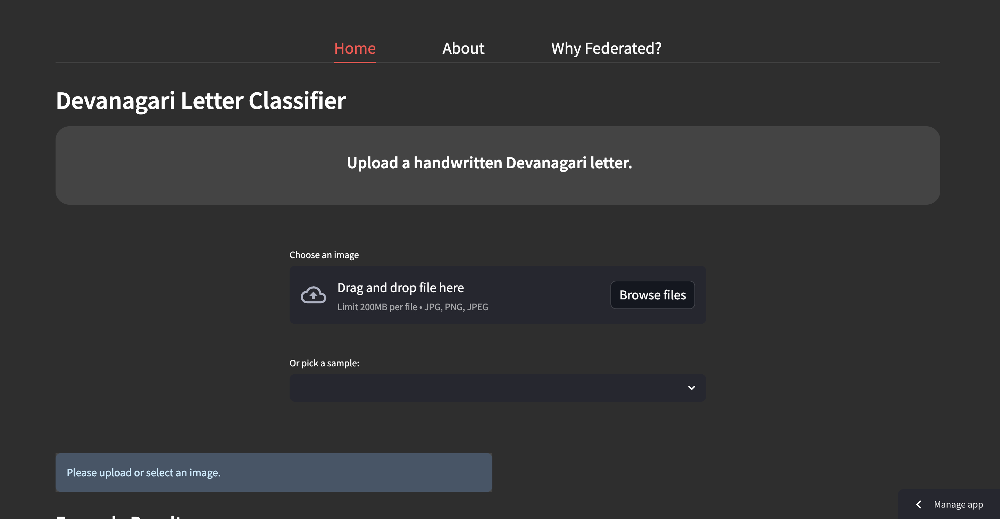
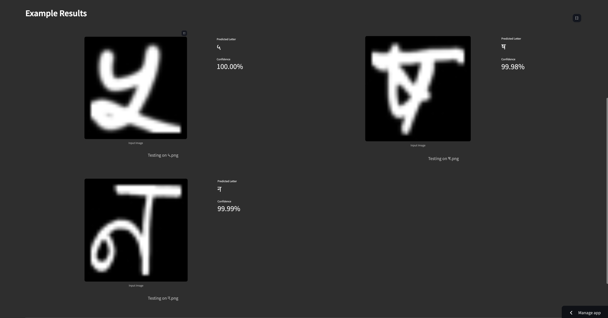
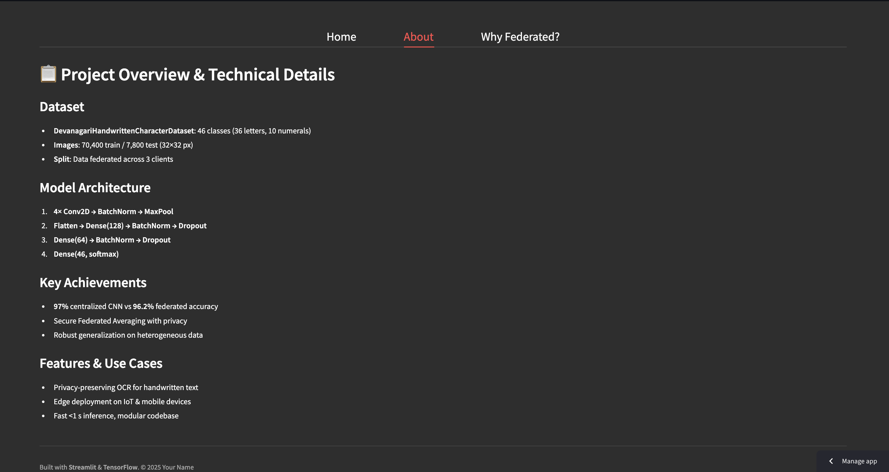
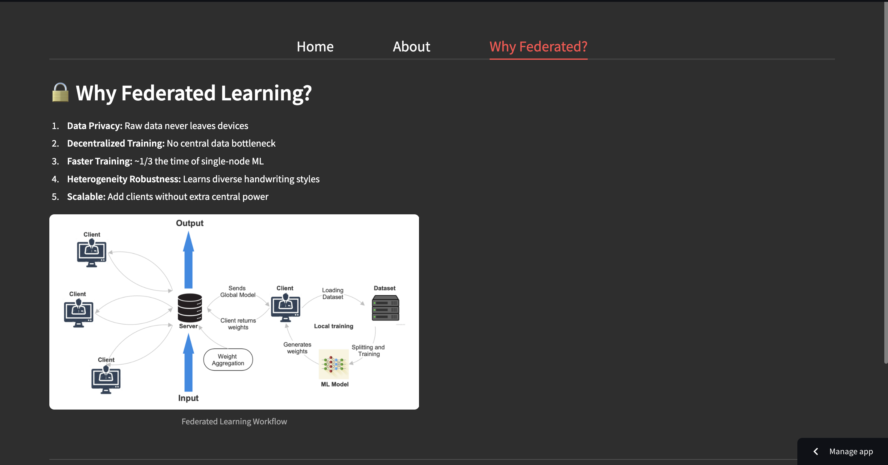

# FedAkshar

A **Federated Image Classifier** that predicts handwritten Devanagari letters (अ, आ, क, ख, etc.) using a **Federated Learning-trained CNN**.  
This project demonstrates secure on-device training while achieving high accuracy without centralizing data. It is deployed using Streamlit.

---

## 🚀 Live Site

[**Visit the live App**](https://eshaanpandey-federated-image-classifier-app-9dusaf.streamlit.app/)

[**Watch working site video**](https://drive.google.com/file/d/1t7o_SSHgL1uxDl_ejizWFQw0uhlwOxGP/view?usp=sharing)

---

## ✨ Features

- Upload your own **handwritten Devanagari image** or select a **sample**.
- **Federated CNN model** trained across distributed devices.
- Displays **predicted letter** and **confidence** instantly.
- Clean, responsive **UI with light theme**.
- Explore detailed **About** and **Why Federated?** tabs.
- View **example predictions**, implementation diagrams, and videos.

---

## 🛠️ Setup Instructions

### 1. Clone the Repository

```bash
git clone https://github.com/your-username/federated-devanagari-classifier.git
cd federated-devanagari-classifier
```

### 2. Install Dependencies

```bash
pip install -r requirements.txt
```

Sample `requirements.txt`:

```
streamlit
tensorflow
opencv-python
numpy
```

### 3. Run the App

```bash
streamlit run app.py
```

---

## 📋 Model Overview

- **Input:** 32×32 grayscale images of Devanagari characters.
- **Classes:** 46 (36 letters + 10 numerals)
- **Architecture:**
  - 4× Conv2D → BatchNorm → MaxPooling
  - Dense(128) → BatchNorm → Dropout
  - Dense(64) → BatchNorm → Dropout
  - Dense(46, Softmax)
- **Federated Averaging** used across 3 clients for training.

---

## Why Federated Learning?

- **Data Privacy:** No raw data leaves devices.
- **Speed:** Faster training compared to centralized learning.
- **Robustness:** Learns diverse handwriting styles.
- **Scalability:** Easily add more edge devices.
- **Security:** Protects personal handwriting samples.

---

## 📸 Screenshots

Homepage





About Section


Why Federated Learning?


Watch the video [here](https://drive.google.com/file/d/1V9S5bxmEuhhzosijswCRyiuAkxYQcegg/view?usp=drive_link)!

---
